# Actividad A1 - Variables y Constantes

## 📱 Proyecto: Clase1App

Esta actividad forma parte de la guía GAA-01 para Kotlin en Android. El objetivo es comprender el uso de `const val`, `val` y `var` en Kotlin, y cómo se aplican en el contexto de una aplicación Android con Jetpack Compose.

---

## ✅ Descripción de la actividad

- Declarar constantes globales con `const val`
- Usar variables mutables con `var`
- Usar constantes locales con `val`
- Imprimir los resultados en Logcat

---
## 🧠 Código utilizado

    kotlin
    // Constantes Globales
    const val APP_NAME = "Clase1App"
    const val APP_VERSION = "1.0.0"
        
    fun tarea1() {
        var contador: Int = 0
        var mensaje: String = "Hola"
        
        val PI: Double = 3.14159
        val DIAS_SEMANA: Int = 7
        
        Log.d("A1", "Nombre app: $APP_NAME")
        Log.d("A1", "Version app: $APP_VERSION")
        Log.d("A1", "$mensaje, contador=$contador")
        Log.d("A1", "PI=$PI, dias=$DIAS_SEMANA")
    }

## 📸 Evidencia en Logcat
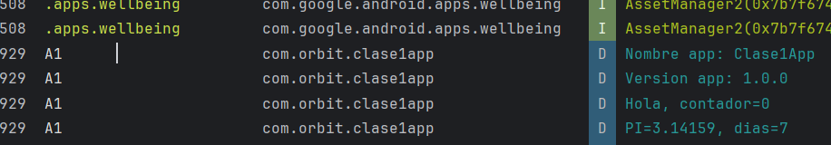

Aprendí que var se usa para declarar variables que pueden cambiar su valor durante la ejecución del programa.
val se usa para declarar constantes locales que no pueden ser reasignadas, aunque pueden contener objetos mutables.
const val se usa para declarar constantes en tiempo de compilación, y solo puede colocarse fuera de clases y funciones.
Comprendí que Kotlin tiene un sistema de tipos muy estricto que ayuda a evitar errores comunes como la reasignación accidental de valores.
Usar Log.d() me permitió verificar que los valores se imprimen correctamente en el Logcat, lo cual es útil para depurar y validar el comportamiento del código.

## ✍️ Reflexión A2

- `Int` se usa para números enteros pequeños o comunes.
- `Long` se usa para números enteros grandes (como población).
- `Float` tiene menos precisión que `Double`, pero ocupa menos memoria.
- `Double` se usa cuando se necesita mayor precisión, como en cálculos científicos.
- Aprendí a usar los sufijos `L` y `f` para declarar correctamente los tipos `Long` y `Fl

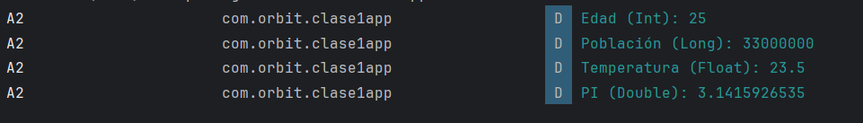

✍️ Reflexión A3
Aprendí que en Kotlin el if puede usarse como expresión, lo que permite retornar valores directamente.
Esto hace el código más limpio y legible.
Usar listas y bucles me permitió probar múltiples casos fácilmente.
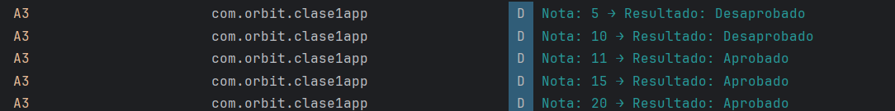

# Actividad A4 - When con rangos

## ✅ Descripción

- Se creó una función `clasificarEdad(edad: Int): String` que clasifica edades usando `when` con rangos.
- Se probó con 5 edades distintas.

## 🧠 Código utilizado

    kotlin
    fun clasificarEdad(edad: Int): String {
        return when (edad) {
            in 0..12 -> "Niño"
            in 13..17 -> "Adolescente"
            in 18..59 -> "Adulto"
            else -> "Mayor"
        }
    }
    
    fun tareaA4() {
        val edades = listOf(5, 14, 30, 60, 80)
        for (edad in edades) {
            val categoria = clasificarEdad(edad)
            Log.d("A4", "Edad: $edad → Categoría: $categoria")
        }
    }

✍️ Reflexión de aprendizaje — Actividad A4
Aprendí a usar la estructura when con rangos (in 0..12) para clasificar valores de forma clara y ordenada.
Esta forma de control de flujo es más legible que múltiples condiciones if, especialmente cuando se trabaja con categorías.
Kotlin permite escribir funciones concisas que retornan directamente valores, lo que mejora la limpieza del código.
Usar listas y bucles me permitió probar varios casos de forma eficiente.
Ver los resultados en Logcat me ayudó a validar que la lógica de clasificación funciona correctamente.

/Ecidencia
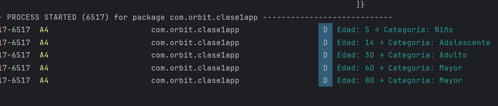

# Actividad A5 - Bucles while y for

## ✅ Descripción

- Se generó la tabla de multiplicar del número 5 usando bucles `while` y `for`.
- Se imprimieron los resultados en Logcat para comparar ambos enfoques.

## 🧠 Código utilizado

    kotlin
    fun tareaA5() {
        val numero = 5
    
        var i = 1
        while (i <= 10) {
            Log.d("A5-while", "$numero x $i = ${numero * i}")
            i++
        }
    
        for (j in 1..10) {
            Log.d("A5-for", "$numero x $j = ${numero * j}")
        }
    }

El bucle for es más legible y directo cuando se conoce el rango de iteración.
El bucle while es útil cuando la condición depende de lógica más compleja.
Kotlin permite escribir ambos tipos de bucles de forma clara y eficiente.
Ver los resultados en Logcat me ayudó a comparar fácilmente ambos enfoques.

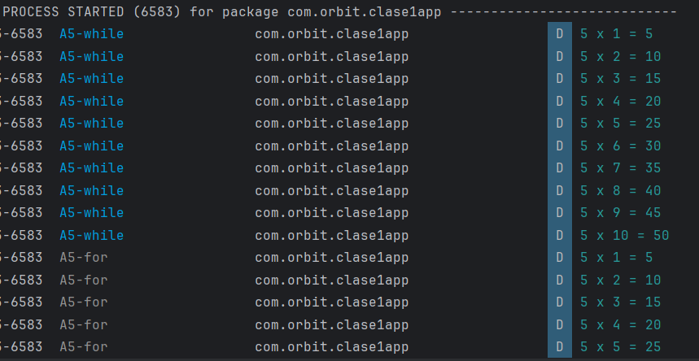

....

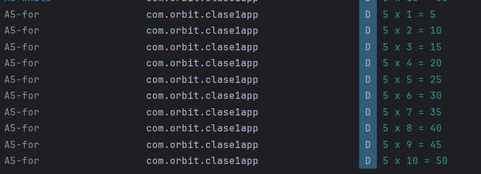

# Actividad A6 - Colecciones y data class

## ✅ Descripción

- Se creó un `data class` llamado `Producto` con los campos `id`, `nombre`, `precio`, `stock`.
- Se generó una lista inmutable con 5 productos.
- Se aplicaron operaciones funcionales para filtrar, mapear, sumar y contar.

## 🧠 Código utilizado

    kotlin
        data class Producto(val id: Int, val nombre: String, val precio: Double, val stock: Int)
    
    fun tareaA6() {
        val productos = listOf(
            Producto(1, "Laptop", 2500.0, 5),
            Producto(2, "Mouse", 50.0, 0),
            Producto(3, "Teclado", 120.0, 3),
            Producto(4, "Monitor", 800.0, 0),
            Producto(5, "USB", 30.0, 10)
        )
    
        val nombresDisponibles = productos.filter { it.stock > 0 }.map { it.nombre }
        val totalInventario = productos.sumOf { it.precio * it.stock }
        val sinStock = productos.count { it.stock == 0 }
    
        Log.d("A6", "Productos disponibles: $nombresDisponibles")
        Log.d("A6", "Valor total del inventario: $totalInventario")
        Log.d("A6", "Cantidad de productos sin stock: $sinStock")
    }
    
✍️ Reflexión
Aprendí a usar data class para representar objetos con propiedades.
Las funciones filter, map, sumOf y count permiten trabajar con colecciones de forma funcional y eficiente.
Kotlin facilita el manejo de listas inmutables y operaciones encadenadas.
Ver los resultados en Logcat me ayudó a validar la lógica de inventario.

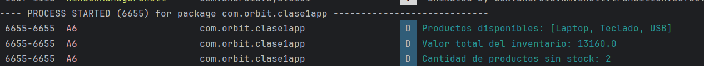

# Actividad A7 - Null Safety en práctica

## ✅ Descripción

- Se creó la función `aEnteroSeguro(s: String): Int` que convierte un string a entero usando `toIntOrNull()` y el operador Elvis `?:`.
- Se probó con entradas válidas e inválidas.

## 🧠 Código utilizado

    kotlin
    fun aEnteroSeguro(s: String): Int {
        val convertido = s.toIntOrNull() ?: -1
        return convertido
    }
    
    fun tareaA7() {
        val entradas = listOf("123", "abc", "45", "", "9999")
    
        for (entrada in entradas) {
            val resultado = aEnteroSeguro(entrada)
            Log.d("A7", "Entrada: \"$entrada\" → Resultado: $resultado")
        }
    }

✍️ Reflexión
Aprendí que toIntOrNull() permite convertir strings a enteros de forma segura, evitando errores por valores inválidos.
El operador Elvis ?: es útil para asignar un valor por defecto cuando el resultado puede ser nulo.
Kotlin facilita el manejo de valores nulos, lo que ayuda a evitar errores como NullPointerException.
Ver los resultados en Logcat me permitió confirmar que los valores inválidos se manejan correctamente.

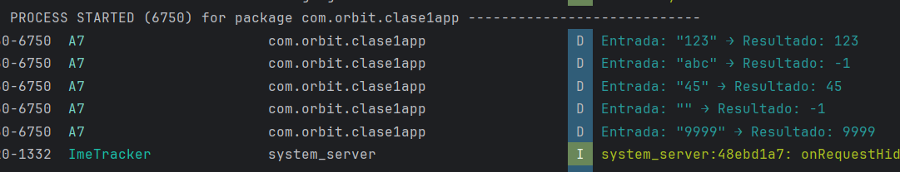

# Actividad A8 - Funciones puras

## ✅ Descripción

- Se implementaron dos funciones puras: `esPrimo(n: Int)` y `fibonacci(n: Int)`.
- Se probó la secuencia de Fibonacci con `n = 10`.
- Se verificó la primalidad de los números 3, 7 y 10.

## 🧠 Código utilizado

    kotlin
    fun esPrimo(n: Int): Boolean {
        if (n < 2) return false
        for (i in 2..Math.sqrt(n.toDouble()).toInt()) {
            if (n % i == 0) return false
        }
        return true
    }
    
    fun fibonacci(n: Int): List<Int> {
        val lista = mutableListOf(0, 1)
        for (i in 2 until n) {
            lista.add(lista[i - 1] + lista[i - 2])
        }
        return lista
    }
    
        fun tareaA8() {
            val fibo = fibonacci(10)
            Log.d("A8", "Fibonacci(10): $fibo")
    
        val numeros = listOf(3, 7, 10)
        for (num in numeros) {
            val primo = esPrimo(num)
            Log.d("A8", "¿$num es primo? → $primo")
        }
    }

✍️ Reflexión
Aprendí que una función pura siempre devuelve el mismo resultado para los mismos argumentos.
fibonacci(n) genera una secuencia sin depender de estados externos.
esPrimo(n) evalúa la primalidad de forma eficiente usando raíz cuadrada.
Estas funciones son ideales para lógica matemática y algoritmos.
Ver los resultados en Logcat me permitió validar la precisión de ambas funciones.

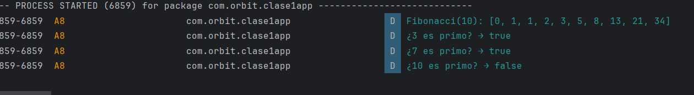

# Actividad A9 - Clases vs data class

## ✅ Descripción

- Se creó una clase regular `Persona` con métodos personalizados.
- Se creó un `data class` llamado `Usuario`.
- Se demostró el uso de `copy()` y comparación con `==`.

## 🧠 Código utilizado

    kotlin
    class Persona(var nombre: String, var edad: Int) {
        fun cumplirAnios() {
        edad++
    }

    fun presentacion(): String {
        return "Hola, soy $nombre y tengo $edad años."
        }
    }

    data class Usuario(val nombre: String, val edad: Int)

    fun tareaA9() {
        val persona = Persona("Luis", 30)
        persona.cumplirAnios()
        Log.d("A9", persona.presentacion())

        val usuario1 = Usuario("Ana", 25)
        val usuario2 = usuario1.copy(edad = 26)
        val sonIguales = usuario1 == usuario2
    
        Log.d("A9", "Usuario original: $usuario1")
        Log.d("A9", "Usuario modificado con copy: $usuario2")
        Log.d("A9", "¿Son iguales? → $sonIguales")
    }

✍️ Reflexión
Aprendí que las clases regulares permiten definir métodos personalizados como presentacion() y modificar propiedades.
Los data class son ideales para representar datos, y ofrecen automáticamente métodos como copy() y equals().
Usar copy() permite crear una nueva instancia modificando solo una propiedad.
Comparar objetos con == en data class evalúa el contenido, no la referencia.
Kotlin facilita el trabajo con estructuras de datos y lógica personalizada.

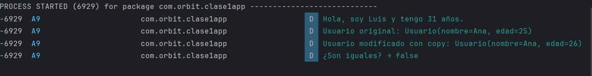

# Actividad A10 - Extensiones y operaciones encadenadas

## ✅ Descripción

- Se crearon dos funciones de extensión: `List<Int>.media()` y `String.capitalizarPrimera()`.
- Se aplicaron sobre una lista de enteros y un texto simple.

## 🧠 Código utilizado

    kotlin
        fun List<Int>.media(): Double {
          return if (this.isNotEmpty()) this.sum().toDouble() / this.size else 0.0
        }
    
    fun String.capitalizarPrimera(): String {
        return this.replaceFirstChar { if (it.isLowerCase()) it.titlecase() else it.toString() }
    }

    fun tareaA10() {
    val numeros = listOf(10, 20, 30, 40, 50)
    val promedio = numeros.media()
    Log.d("A10", "Promedio de la lista: $promedio")

    val texto = "kotlin es genial"
    val capitalizado = texto.capitalizarPrimera()
    Log.d("A10", "Texto capitalizado: $capitalizado")
}

✍️ Reflexión
Aprendí que las funciones de extensión permiten agregar funcionalidades a tipos existentes sin heredar ni modificar su definición.
List<Int>.media() simplifica el cálculo de promedios.
String.capitalizarPrimera() mejora la presentación de textos.
Kotlin facilita la escritura de código limpio y reutilizable.
Ver los resultados en Logcat me permitió validar el comportamiento de las extensiones.

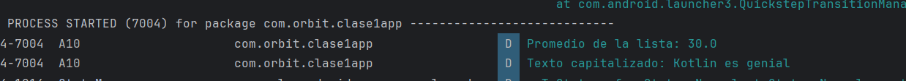

# Actividad A11 - Mini reporte declarativo

## ✅ Descripción

- Se generó una lista de números del **1 al 20**.  
- Se filtraron únicamente los números **pares** usando `filter`.  
- Se calculó la **suma** de los pares con `sum()`.  
- Se obtuvo el **promedio** con `average()`.  

## 🧠 Código utilizado

kotlin
fun tareaA11() {
    val nums = (1..20).toList()

    val pares = nums.filter { it % 2 == 0 }
    val sumaPares = pares.sum()
    val promedioPares = pares.average()

    Log.d("A11", "Números pares: $pares")
    Log.d("A11", "Suma de pares: $sumaPares")
    Log.d("A11", "Promedio de pares: $promedioPares")
}

✍️ Reflexión
Aprendí a usar operaciones declarativas (filter, sum, average) para trabajar con colecciones en Kotlin.
El filtrado de números pares se hace de manera sencilla y expresiva.
La suma y el promedio se obtienen sin necesidad de bucles manuales, lo que hace el código más limpio.
Este enfoque declarativo facilita la legibilidad y reduce errores comunes en cálculos numéricos.

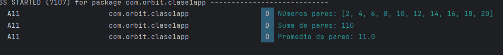

